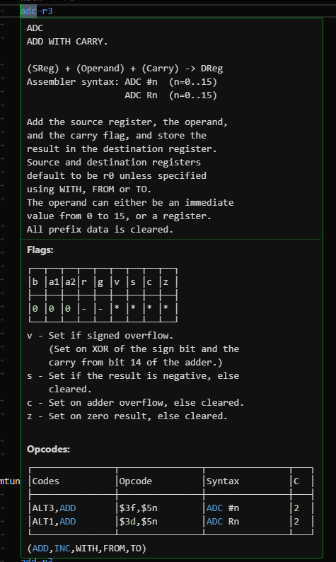

# Super FX Assembly Help

This Visual Studio Code extension is a recreation of the Super FX (MARIO) code help parser BRIEF macro thing that Argonaut Software used while developing Star Fox 1/2.  

When a valid instruction is hovered over, it shows a tooltip box with info about the current instruction.  

This extension is currently only compatible with Argonaut's assemblers (SASM, ARGSFX, file extension *.MC) and Randal Linden's xAsm assembler (file extension *.a).  

The associated language must be plain Assembly for it to function at the moment.

## How to Compile

Node.js, Git, and probably Visual Studio Code itself must be installed for this to compile. I don't know why Git is required, but it is.  
Open a PowerShell terminal window in the root of the repo and run ``npm install`` and ``npm install -g @vscode/vsce`` to setup all the dependencies.  
Run ``npm run compile`` to compile.  
Run ``vsce package`` to build a VSIX file that can be installed.  
Alternatively, use ``getmodules.cmd`` to install dependecies, use ``build.cmd`` to compile, and use package.cmd to make the VSIX file.